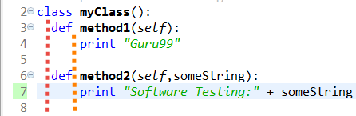

# holbertonschool-higher_level_programming

Holberton's Higher Level Programming curriculum has students learn the basics of Python and object-oriented programming. Later down the line, we learn about SQL databases as well as the basics of javascript and web scraping.

Down below are some highlight projects from this repository:

## [python-classes](https://github.com/faspen/holbertonschool-higher_level_programming/tree/main/0x06-python-classes)

This project introduced us to the basics of object-oriented programming in python for the first time. We learned about getter and setter methods as well as class initializers.

## [SQL_introduction](https://github.com/faspen/holbertonschool-higher_level_programming/tree/main/0x0D-SQL_introduction)

We got our first taste of SQL databases and queries in this project. This one was my personal favorite since it was just fun in general to work with. While table joinings weren't covered in this, we did learn how to cherry pick specific kinds of data from a table, like the average score on a test or listing data in an ordered fashion.

## [javascript-warm_up](https://github.com/faspen/holbertonschool-higher_level_programming/tree/main/0x12-javascript-warm_up)

We learned bare-bones concepts from this project, whether it was learning how to print an sentence or finding the factorial of a given number. Later, we would go on to learn how to use javascript with web dev elements.

## Biggest Challenges

By far, it was installing pip packages. All sorts of issues would be encountered while installing, whether it was pip itself needing an update or the package being depracated.
Another was the version of python we used. We used python 3.5, a version that's quite old. If we wanted to experiment with different libraries that required a more recent version of the language, we had to code elsewhere.

## Creator

Finn Aspenson

* [Twitter](https://twitter.com/FAspenson)
* [LinkedIn](https://www.linkedin.com/in/finn-aspenson-0a23841b6/)
* Here's a notable [project](https://github.com/mlaizure/dragonfly)